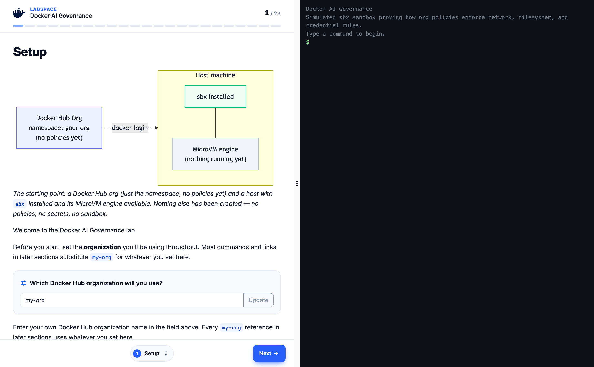

# Docker AI Governance — interactive Labspace

An interactive, fully in-browser lab that proves how **Docker AI Governance**
policies flow from one Admin Console toggle to every developer's `sbx` sandbox —
covering **network**, **filesystem**, and **credential** enforcement, the MCP
Gateway, observability, and Sandbox Kits.

**Define once. Enforce everywhere.**

[](https://ajeetraina.github.io/labspace-ai-governance-demo/)

> Live at **[ajeetraina.github.io/labspace-ai-governance-demo](https://ajeetraina.github.io/labspace-ai-governance-demo/)**

Built on [Labspace](https://github.com/dockersamples/labspace-web). Everything in
the terminal is **simulated** — no real Docker, `sbx`, backend, or network — so it
runs the same for everyone, with nothing to install. It's the web/simulated
companion to the real-hardware lab at
[ajeetraina/labspace-docker-ai-governance](https://github.com/ajeetraina/labspace-docker-ai-governance).

## What you can do live in the browser

The flagship demos are click-to-run against a scripted `sbx` sandbox:

- **Network enforcement** — three `curl`s, three outcomes: `anthropic: 404`
  (allowed → reached origin), `paste.ee: 403` (deny rule), `example.com: 403`
  (default-deny), all decided at the sbx proxy.
- **Filesystem enforcement** — `sbx run shell . ~/.ssh:ro` fails at creation with
  `403 mount policy denied`, matched to the `deny credentials` rule.
- **Policy sync** — `sbx policy ls` / `reset` / `log` show org rules landing with
  `ORIGIN: remote` while local defaults go inactive.
- **Credential isolation** — inside the sandbox `ANTHROPIC_API_KEY=proxy-managed`
  (a sentinel, never the real key).

The other 20+ sections (Policy Model, MCP Hands-On, Product Catalog, Observability,
Audit Logging, Governance API, and the six-part Sandbox Kits track) are rendered
read-only with the exact commands and expected output.

## Author / preview locally

You only need Docker.

```bash
docker compose up dev              # live preview at http://localhost:5173
docker compose run --rm validate   # lint the lab (fails on errors)
```

Edit the files in [`lab/`](lab/) and refresh the browser to see changes:

- `lab/labspace.yaml` — title, terminal, seed files, the 23 sections, variables
- `lab/simulator.yaml` — what each runnable command does (scenarios)
- `lab/*.md`, `lab/kits/*.md` — one file per section of instructions

## Deploy to GitHub Pages

1. **Enable Pages once:** repo **Settings → Pages → Source: "GitHub Actions"**.
2. **Push to `main`.** The workflow in
   [`.github/workflows/deploy.yml`](.github/workflows/deploy.yml) validates the lab
   and publishes it to `https://ajeetraina.github.io/labspace-ai-governance-demo/`.

Pull requests are validated first by
[`.github/workflows/validate.yml`](.github/workflows/validate.yml).

**As a container** instead — the [`Dockerfile`](Dockerfile) bases on the runtime
image and swaps in this lab:

```bash
docker build -t ai-governance-lab .
docker run --rm -p 8080:80 ai-governance-lab    # http://localhost:8080
```

## Learn more

See [`AGENTS.md`](AGENTS.md) for the authoring cheat-sheet and the
[Labspace specs](https://github.com/dockersamples/labspace-web/tree/main/spec) for
the full `simulator.yaml` / `labspace.yaml` reference.
